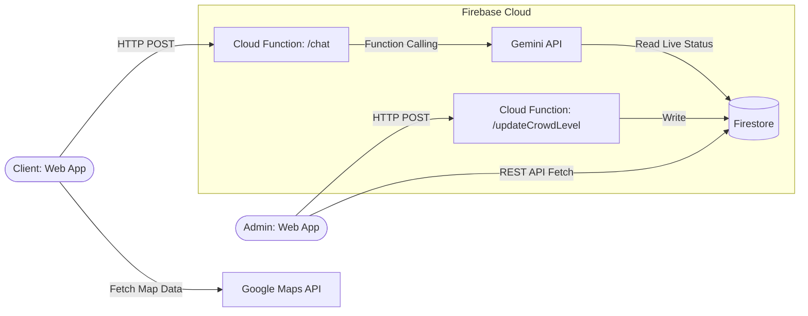

# Venue Sahayak

An AI-powered fan assistant and venue management tool for real-time crowd navigation and status reporting.

## Problem Statement Alignment

| Hackathon Requirement      | Implementation Location                                                                                                                                    | Description                                                                                        |
| -------------------------- | ---------------------------------------------------------------------------------------------------------------------------------------------------------- | -------------------------------------------------------------------------------------------------- |
| Crowd Management           | `public/admin.html`, `public/js/admin.js`, `functions/firestore.js` (Tested via `tests/integration/admin-endpoint.test.js`, `tests/frontend/chat.test.js`) | Volunteer admin panel allowing real-time updates of zone crowd levels (Low/Medium/High).           |
| Indoor Navigation          | `public/js/map.js` (Tested via `tests/frontend/map.test.js`)                                                                                               | Google Maps integration with custom markers and dynamic pins for visual routing.                   |
| Real-Time Decision Support | `functions/gemini.js` (Tested via `tests/unit/gemini.test.js`, `tests/integration/chat-endpoint.test.js`)                                                  | Generative AI integration that answers fan queries using live Firestore data via function calling. |
| Multi-Language Assistance  | `functions/gemini.js`, `public/js/chat.js` (Tested via `tests/accessibility/accessibility.test.js`, `tests/unit/gemini.test.js`)                           | Gemini is prompted to match the fan's language; UI updates `lang` attribute dynamically for a11y.  |

## Architecture



## Tech Stack

| Component           | Technology                    | Purpose                                                    |
| ------------------- | ----------------------------- | ---------------------------------------------------------- |
| **Frontend UI**     | Firebase Hosting              | Hosts the static HTML/CSS/JS frontend.                     |
| **Backend Compute** | Cloud Functions (Node 20, v2) | Serverless execution of the chat and update API endpoints. |
| **Database**        | Firestore                     | NoSQL document database storing real-time zone data.       |
| **Intelligence**    | Gemini API                    | Natural language understanding and response generation.    |
| **Mapping**         | Google Maps JavaScript API    | Visual rendering of venue layout and crowd levels.         |
| **Tooling**         | Google Antigravity & Stitch   | Codebase scaffolding and UI design generation.             |

## Setup Instructions

1. **Clone the repository:**

   ```bash
   git clone <repository-url>
   cd venue-sahayak
   ```

2. **Install dependencies:**

   ```bash
   cd functions
   npm install
   cd ..
   ```

3. **Configure environment variables:**
   See the [Environment Setup](#environment-setup) section below — complete that before running locally or deploying.

4. **Run the Firebase Emulators:**
   Start the local development environment.

   ```bash
   firebase emulators:start
   ```

5. **Deploy to production:**
   ```bash
   firebase deploy
   ```

## Environment Setup

Follow these steps in order. A new developer should be able to go from a fresh clone to a running local dev environment in under 5 minutes.

**This project separates config from secrets:**

- _Config_ (non-sensitive values like rate limits, model name, region) lives in `.env` and `functions/.env`, loaded natively by Firebase Functions.
- _Secrets_ (API keys) are stored in Firebase Secret Manager and are never written to any file.

### Step 1 — Copy the example files

```bash
cp .env.example .env
cp functions/.env.example functions/.env
```

### Step 2 — Fill in non-secret config

Edit `.env` and `functions/.env`. Required values:

| Variable                    | Where to get it                                                                                    |
| --------------------------- | -------------------------------------------------------------------------------------------------- |
| `FIREBASE_PROJECT_ID`       | Firebase Console > Project Settings                                                                |
| `GOOGLE_MAPS_API_KEY`       | [Cloud Console > APIs & Services > Credentials](https://console.cloud.google.com/apis/credentials) |
| `GEMINI_MODEL`              | Default `gemini-2.0-flash` — change only if needed                                                 |
| `FIREBASE_REGION`           | Default `asia-south1` — change only if needed                                                      |
| `ALLOWED_ORIGIN`            | `http://localhost:5000` for local dev; your Hosting URL for prod                                   |
| `RATE_LIMIT_PER_MINUTE`     | Default `10`                                                                                       |
| `MAX_MESSAGE_LENGTH`        | Default `500`                                                                                      |
| `FUNCTIONS_MEMORY`          | Default `256MiB`                                                                                   |
| `FUNCTIONS_TIMEOUT_SECONDS` | Default `30`                                                                                       |

**Maps key security:** After obtaining `GOOGLE_MAPS_API_KEY`, restrict it immediately:

> Cloud Console > APIs & Services > Credentials > your key > Application restrictions > HTTP referrers > add `https://your-project.web.app/*`

### Step 3 — Set the Gemini API secret

`GEMINI_API_KEY` is a true secret. Do not put it in any file. Store it in Firebase Secret Manager:

```bash
# Obtain your key from https://aistudio.google.com/app/apikey
firebase functions:secrets:set GEMINI_API_KEY
# You will be prompted to enter the value — it is never written to disk
```

Verify it was stored:

```bash
firebase functions:secrets:access GEMINI_API_KEY
```

### Step 4 — Build the frontend config

This injects `GOOGLE_MAPS_API_KEY` into a gitignored file (`public/js/env-config.js`) that the browser loads:

```bash
npm run build
```

### Step 5 — Verify environment before deploying

```bash
npm run env:check
```

This script checks all required variables are present and exits with a clear list of anything missing. It runs automatically as a `predeploy` hook, so `firebase deploy` will fail early if something is missing.

### Step 6 — Start local dev

```bash
firebase emulators:start
```

### Step 7 — Deploy to production

```bash
firebase deploy
# predeploy hook (env:check + build) runs automatically
```

## Testing

Comprehensive testing is implemented using Jest. The test suite comprises 202 exact tests validating the application's correctness, robustness, and accessibility.

Our testing philosophy is built on distinct layers of responsibility:

- **Unit Tests (`tests/unit`)**: Validate isolated logic (e.g., LLM prompts, tool-calling guards, Firestore schema enforcements).
- **Integration Tests (`tests/integration`)**: Verify that HTTP endpoints and serverless functions correctly bridge the frontend requests and backend services, gracefully handling HTTP error states and rate limits.
- **Frontend Tests (`tests/frontend`)**: Ensure client-side JavaScript correctly mounts and interacts with the DOM elements.
- **Security Tests (`tests/security`)**: Simulate malicious inputs and boundary violations against Firebase Security Rules.
- **Accessibility Tests (`tests/accessibility`)**: Programmatically verify WCAG compliance, ARIA attributes, and semantic HTML structure.

### Coverage Metrics

The current test suite provides the following coverage metrics (from exact coverage output):

- **Overall Lines**: 97.05%
- **Overall Statements**: 96.57%
- **Overall Branches**: 95.00%
- **Overall Functions**: 90.00%
- **`gemini.js`**: 100% Lines, 98.03% Statements, 96.42% Branches, 87.5% Functions
- **`firestore.js`**: 100% Lines, 100% Statements, 95.45% Branches, 100% Functions

> [!NOTE]
> For full granular breakdown of the tests, see [tests/COVERAGE_SUMMARY.md](tests/COVERAGE_SUMMARY.md) and [tests/README.md](tests/README.md).

### Running Tests

Execute the following commands to run the test suite:

- **Run all tests**: `npm run test`
- **Run all tests with coverage report**: `npm run test:coverage`
- **Run Unit tests only**: `npm run test:unit`
- **Run Integration tests only**: `npm run test:integration`
- **Run Frontend tests only**: `npm run test:frontend`
- **Run Security tests only**: `npm run test:security`
- **Run Accessibility tests only**: `npm run test:a11y`

## Security Notes

- **Input Validation:** All client inputs are strictly validated on the server. The `chat` endpoint validates message structure, and the `updateCrowdLevel` endpoint enforces the `low`/`medium`/`high` enum.
- **Firestore Rules:** The database schema is minimal and restrictive. Reads are publicly accessible to allow the admin UI to fetch the current status, but writes are exclusively restricted to the Cloud Functions backend (denied to direct client requests).
- **Rate Limiting:** A lightweight rate-limiting mechanism is implemented on the `chat` endpoint to prevent abuse (HTTP 429).
- **CORS Constraints:** Functions are configured to reject cross-origin requests from unauthorized domains, ensuring requests only originate from the hosted application.

## Folder Structure

```
venue-sahayak/
├── public/                 # Static assets and frontend HTML/JS/CSS served via Firebase Hosting
├── functions/              # Backend Firebase Cloud Functions (v2) and Core logic
├── tests/                  # Unit and integration test suites using Jest
├── scripts/                # Utility scripts, including database seeding
├── ACCESSIBILITY.md        # Documentation on accessibility and robustness compliance
└── firebase.json           # Firebase configuration for emulators, hosting, and functions
```

## Known Limitations & Out-of-Scope Items

- **Stateless Chat:** There is no persistent conversational memory or user session tracking for the AI. Each query is treated independently. This ensures low latency and minimal privacy risk for a hackathon MVP.
- **Authentication:** The volunteer admin panel requires a self-reported name for auditing but does not implement a hardened IAM flow (e.g., Firebase Auth) in the current iteration.
- **Map Accuracy:** The application uses standard Google Maps rather than a custom indoor-mapping overlay. Precise granular indoor routing is simulated via pin coordinates.

## License

This project is licensed under the MIT License.
